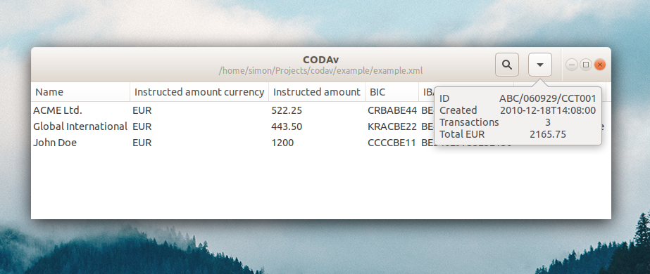

# CODAv

An "XML message for Credit Transfer Initiation" (ISO 20022 XML) file encodes European credit transfers (SEPA) in a standard way. It's often refered to as a "CODA (Coded Statement of Account) file". It requests the movement of funds from the debtor account to a creditor.

CODAv is a desktop application that understands these electronic messages and serves as a viewer to verify the contents of these files. CODAv follows the [Belgian implementation guidelines](https://www.febelfin.be/sites/default/files/files/standard-credit_transfer-xml-v31-en_0.pdf) as defined by the Belgian sector federation [Febelfin](https://www.febelfin.be).



The current itteration shows all fields from the CODA XML in a table view like one would expect on a spreadsheet. A sperate panel shows the header fields and the sum of all transactions per currency.

## Install

CODAv is tested on Ubuntu 16.04 and macOS El Capitan. It's written in Vala and depends on GTK 3 and libxml 2.

### Linux (Ubuntu)

To compile CODAv from source on an Ubuntu 16.10 machine:

```
sudo add-apt-repository ppa:vala-team
sudo apt update
apt install valac libgtk-3-dev libxml2-dev
valac --pkg gtk+-3.0 --pkg libxml-2.0 -o codav src/*.vala
```

### macOS (El Capitan)

Make sure you have [Homebrew](https://brew.sh/) and run:

```
brew install gtk+3 adwaita-icon-theme vala
valac --pkg gtk+-3.0 --pkg libxml-2.0 -o codav src/*.vala
```
